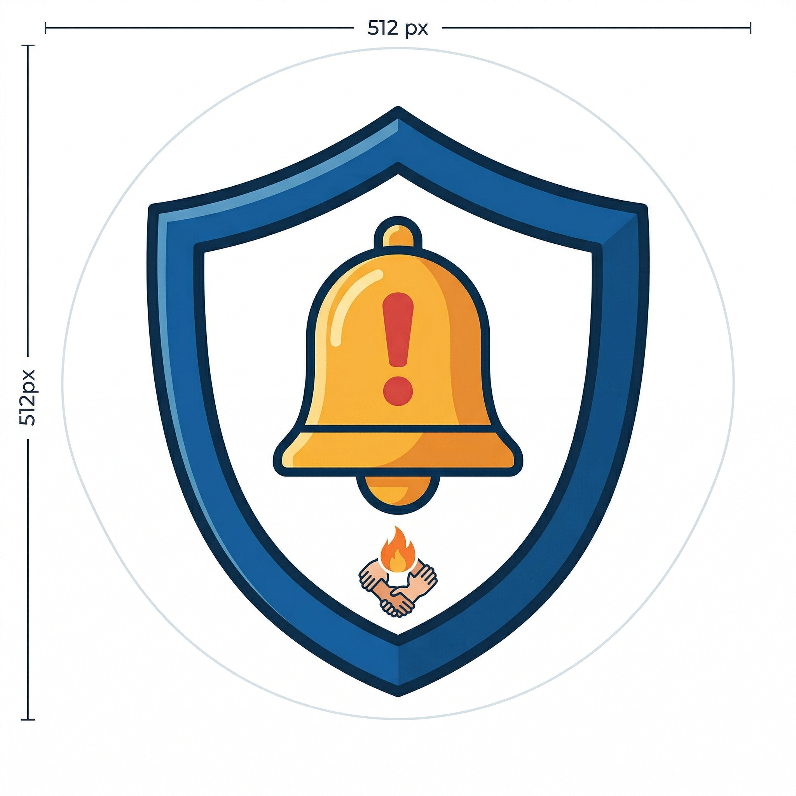

# 🛡️ Defesa Em Foco

Aplicativo de defesa civil para gestão de emergências e segurança comunitária.

## 📋 Descrição

Defesa Em Foco é um aplicativo móvel desenvolvido em Flutter que visa fornecer informações essenciais e recursos para o gerenciamento de emergências e segurança da comunidade.

## 🚀 Funcionalidades

- 🗺️ Mapa interativo com pontos de interesse
- 📝 Relatório de ocorrências
- 👥 Gerenciamento de usuários
- 📱 Interface intuitiva

## 📸 Screenshots

## 📱 Instalação

1. Clone o repositório
2. Instale as dependências: `flutter pub get`
3. Execute: `flutter run`

## 🔗 Links

- [📱 Play Store](https://play.google.com/apps/testing/defesa.civil.foco)
- [📊 Apresentação](./Defesa_Em_Foco_Aplicativo_de_Defesa_Civil.pptx)

## 👥 Equipe

- Reinaldo Henrique Morais
- Pedro Guedes de Azevedo